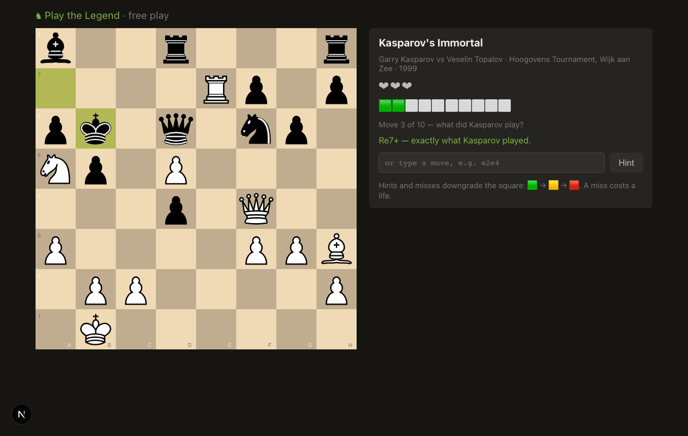

# ♞ LegendChess

_Working title — see `docs/launch/checklist.md`._ An open-source daily chess
game: step into the shoes of a legend — Kasparov, Fischer, Morphy, Magnus —
and find the moves they actually played in their most famous games. Three
lives, escalating hints, partial credit when the engine says your move was
just as good, and a Wordle-style share grid. One puzzle a day, same for
everyone on Earth.



## How it plays

1. The scene is set: _"Wijk aan Zee, 1999. You are Garry Kasparov."_ The game
   auto-replays to the critical moment.
2. You play the hero's next 7–15 moves. Exact move → 🟩. A move Stockfish
   rates just as strong → 🟨 (the real game continues on rails). Miss → lose a
   life, get a hint, try again.
3. Out of lives? You watch the masterpiece finish without you.
4. Share your grid. Come back tomorrow. Keep the streak. 🔥

```
LegendChess #1 — Garry Kasparov, Hoogovens Tournament, Wijk aan Zee 1999
🟩🟩🟨🟩🟩🟥🟩🟩🟨🟩
❤❤ 745/1000
```

## The library so far

Kasparov's Immortal · The Opera Game · The Immortal Game · The Evergreen Game
· The Immortal Zugzwang · Rubinstein's Immortal · The Gold Coins Game · The
Game of the Century · Carlsen–Nepo, the longest WC game ever · Kasparov vs the
World · Deep Blue's first win · The Immortal Draw · The Peruvian Immortal ·
The Polish Immortal · Fischer–Spassky g6 1972 · Kasparov's Octopus ·
Carlsen's first crown · the Qh6+!! tiebreak · the Runaway Pawn.

**Adding a game is a config-file PR — no code.** See
[CONTRIBUTING.md](CONTRIBUTING.md); every movetext is replay-validated against
a public source, every eval table is engine-generated and machine-checked.

## How it's built

| Path             | What it is                                                                                                                                    |
| ---------------- | --------------------------------------------------------------------------------------------------------------------------------------------- |
| `packages/core`  | Pure TS ruleset: schema, grading, lives/hints, scoring, share grid — the ONLY implementation, used by browser, tests and server alike         |
| `packages/forge` | Authoring pipeline: bare PGN + curation config → validated puzzle JSON with a Stockfish eval for **every legal move** at every decision point |
| `apps/web`       | Next.js + [chessground](https://github.com/lichess-org/chessground) (lichess's own board), daily loop, streaks, leaderboard                   |
| `dist/puzzles/`  | Frozen, committed puzzle artifacts — same date, same evals, forever                                                                           |
| `supabase/`      | Optional accounts + server-verified leaderboard (clients submit action logs, never scores)                                                    |
| `docs/adr/`      | Why everything is the way it is, decided when it was decided                                                                                  |

No engine ships to the browser. Anonymous play needs no account, no network
after load. The plan that grew this repo milestone by milestone is
[plan.md](plan.md).

## Development

Prerequisites: Node ≥ 22, pnpm ≥ 9. Stockfish only if you author puzzles.

```bash
pnpm install
pnpm lint && pnpm typecheck && pnpm test      # all packages
pnpm --filter @legendchess/web dev          # http://localhost:3105
pnpm --filter @legendchess/web e2e          # playwright, desktop + mobile
```

## License

[GPL-3.0-or-later](LICENSE) — we keep the
forks open (see [ADR 0002](docs/adr/0002-gpl-license.md)).

Not affiliated with or endorsed by any chess player, federation, or chess
app. Historical game scores are facts in the public domain; all story
blurbs are original.
